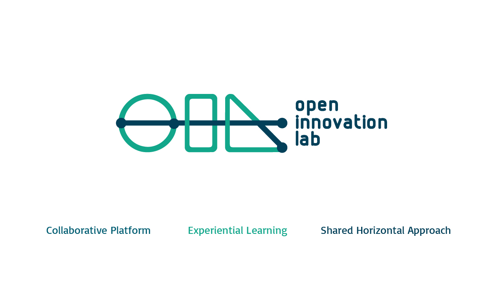
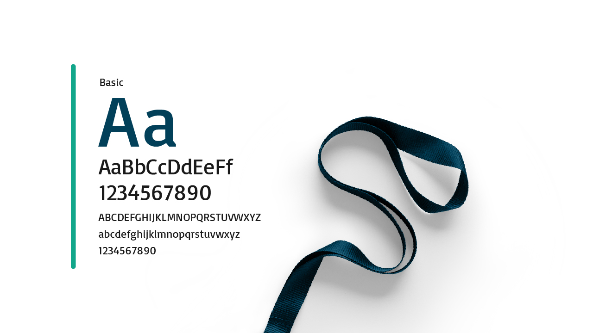
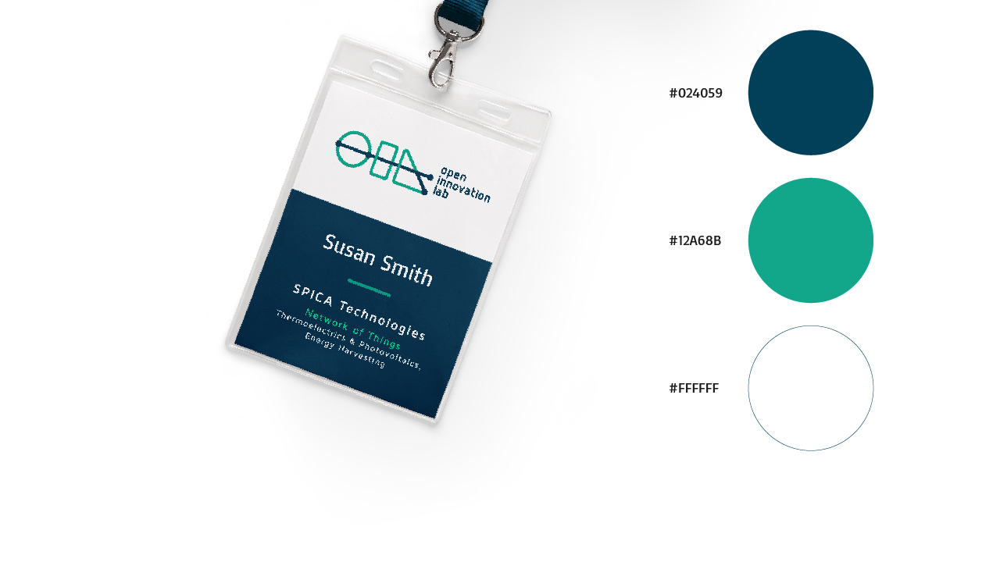
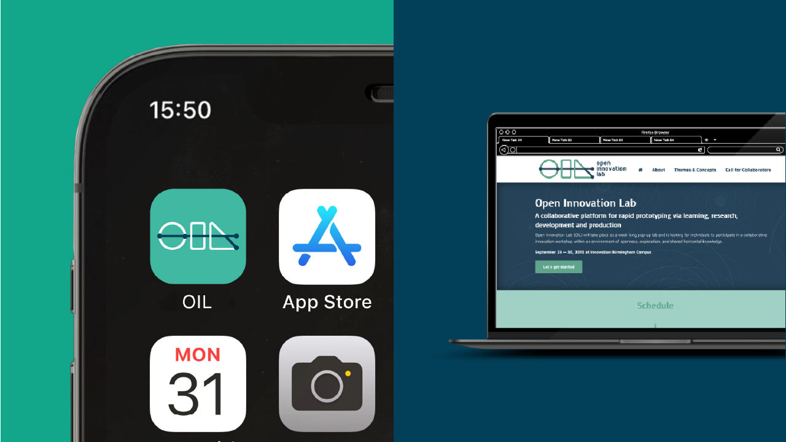

---

projectName: 'Diseñando la imagen de Open Innovation Lab'
projectDescription: 'Open Innovation Lab se concibe como un “pop-up lab” organizado por la universidad de Birmingham (UK) que consistió en un taller de innovación colaborativa entre startups, empresas con proyectos innovadores aún en fase de desarrollo, y colaboradores, personas interesadas en participar en procesos de innovación colaborativa bajo la metodología conocida como STEAM (Science, Techonology, Engineering, Art, Mathematics).'
projectPurpose: 'Mi rol consistió en diseñar la identidad gráfica del evento y crear su sitio web. El objetivo principal era el de atraer a un gran número de colaboradores a participar.'

---

import ProjectLayout from '../../layouts/ProjectLayout.astro';
import image from './_2015-open-innovation-lab/cover.jpg';

export const cover = {src: image.src, alt: ''};

<ProjectLayout projectFrontmatter={frontmatter} projectCover={cover}>

<figure>
  
  
  
  
</figure>

 

  <a class="outline secondary" role="button" href="http://oil.bustobocanegra.com/" target="_blank" style="display: block; margin: 0 auto">Visita la web <i class="icon arrow-right"></i></a>

</ProjectLayout>
