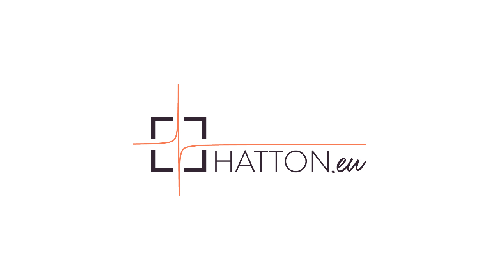
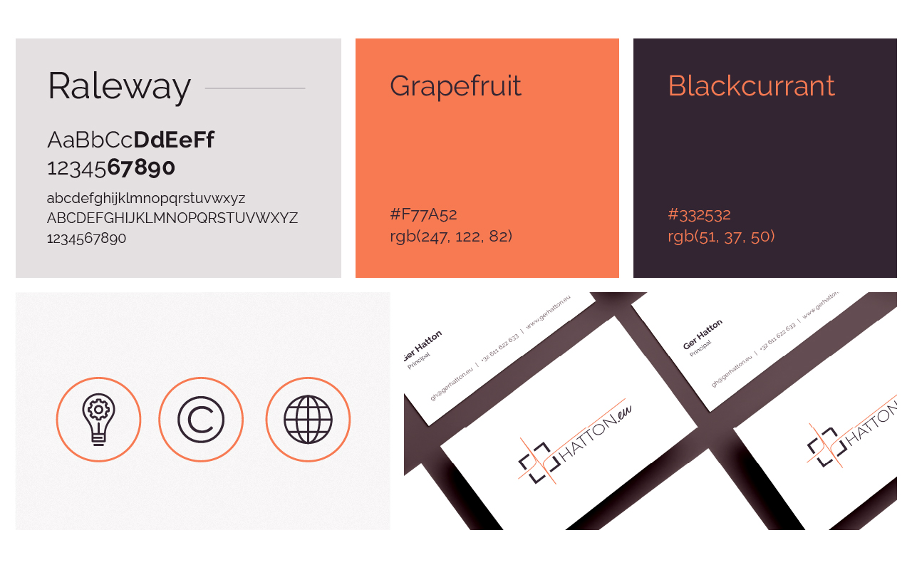
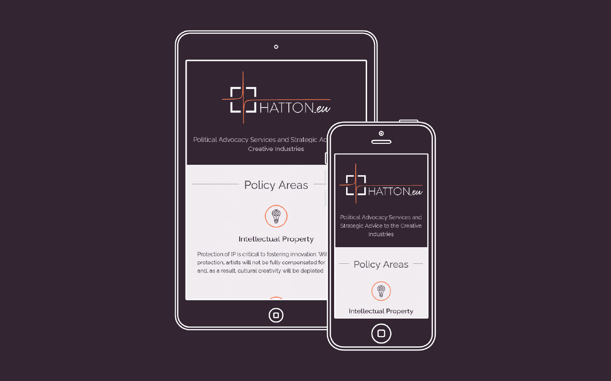

---

projectClient: 'Hatton.eu'
projectName: 'Identidad gráfica y sitio web para sector consultoría'
projectDescription: 'Hatton.eu ofrece servicios de consultoría en el ámbito de la industria creativa.'
projectPurpose: 'Mi rol consistió en crear una identidad gráfica personal y un sitio web que provea información y facilite la relación entre empresa y cliente.'

---

import ProjectLayout from '../../layouts/ProjectLayout.astro';
import image from './_2016-hatton-eu/cover.jpg';

export const cover = {src: image.src, alt: 'hatton-eu'};

<ProjectLayout projectFrontmatter={frontmatter} projectCover={cover}>

 

  <a class="outline primary" role="button" href="https://www.gerhatton.eu/" target="_blank" style="display: block; margin: 0 auto">Visita la web <i class="icon arrow-right"></i></a>

</ProjectLayout>
