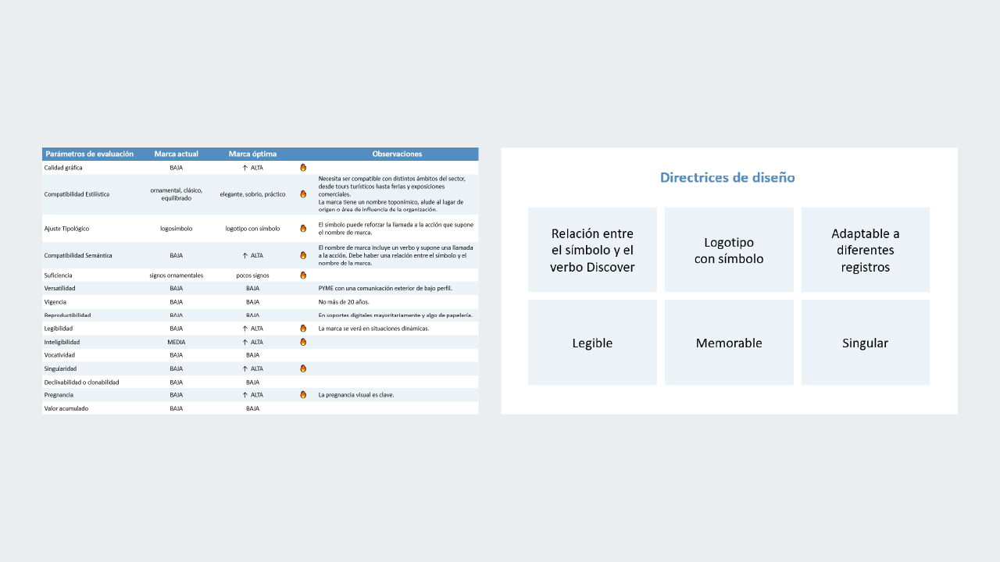

---

projectName: 'Discover Cantabria · Identidad gráfica para sector turismo'
projectDescription: 'Discover Cantabria presta servicios de asistencia y guía de turismo a visitantes de la región de Cantabria. El equipo de Discover Cantabria aspira a ser catalizador de experiencias inolvidables que hagan que el visitante se convierta en futuro embajador de la región, promocionando el valor único de sus bienes tangibles e intangibles.'
projectPurpose: 'Crear una marca gráfica acorde con el abanico de servicios que ofrece la empresa.'

---

import ProjectLayout from '../../layouts/ProjectLayout.astro';
import image from './_2021-discover-cantabria/cover.jpg';

export const cover = {src: image.src, alt: 'Discover Cantabria'};

<ProjectLayout projectFrontmatter={frontmatter} projectCover={cover}>

## Marca gráfica

  ### Investigación

  1. Sector y competencia
  2. Entrevistas
  3. Perfil de marca
  4. Estrategia de marca
  5. Directrices de diseño

  Tras realizar un análisis del sector y de la competencia, se realizaron una serie de entrevistas y un perfil de marca. Posteriormente, se concretó una estrategia de marca y unas directrices de diseño.

  La marca óptima debe ser:

  - Singular, legible y memorable.
  - Versátil y adaptable a diferentes registros.
  - Fácil de mantener y sostener en el tiempo.

  ### Inspiración

  El estilo gráfico se inspira en las formas geométricas de las estelas cántabras. La más famosa de ellas, la Estela de Barros, forma parte del actual escudo de Cantabria.

  El nombre Discover Cantabria:
  
  - Contiene una llamada a la acción.
  - Apela a la experiencia personal del cliente, especialmente del público extranjero, pues el nombre de la marca usa el idioma inglés.
  - En la acción de descubrir se revela la novedad, la emoción o la sorpresa.

  ### Definición

  Discover Cantabria es una entidad de confianza, sociable y entusiasta.

  El símbolo gráfico representa dos ojos que se abren a descubrir nuevas experiencias, a la vez que sugiere las iniciales de la empresa, D y C.

  ### Aplicaciones

  Ejemplos de aplicación de la marca en algunos de sus potenciales soportes.

</ProjectLayout>
