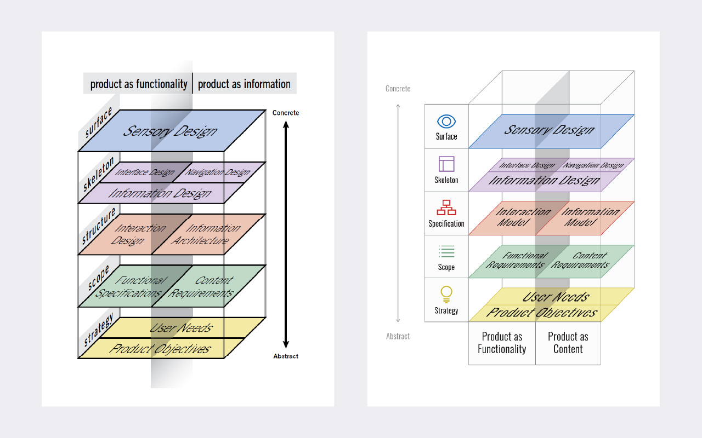
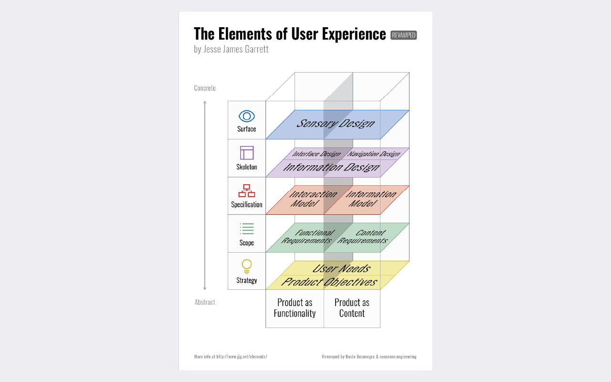

---

projectClient: ''
projectName: 'Poster de “The Elements of User Experience”'
projectDescription: '‘The Elements of User Experience’ es un libro de referencia sobre los elementos que componen la experiencia de usuario en el ámbito digital y cuyos fundamentos me han ayudado mucho a la hora de conceptualizar un proyecto.
Para explicar estos elementos, su autor, James Garrett, utiliza un esquema, el cual me gustó tanto que decidí hacer un poster para tenerlo siempre a la vista.'
projectPurpose: 'Este proyecto es el resultado de una colaboración en la que aspiramos a mejorar la generalidad del original, proponiendo cambios en la composición y en la nomenclatura con el fin de aproximarlo a nuestro criterio.'

---

import ProjectLayout from '../../layouts/ProjectLayout.astro';
import image from './_2021-the-elements-of-ux/cover.jpg';

export const cover = {src: image.src, alt: 'The Elements of User Experience'};

<ProjectLayout projectFrontmatter={frontmatter} projectCover={cover}>

<figure>
  
  <figcaption>Original vs New version</figcaption>
</figure>

  <bockquote>
  “Experience design is the design of anything, independent of medium, or across
  media, with human experience as an explicit outcome, and human engagement
  as an explicit goal.” – <i>Jesse James Garrett</i>
  </bockquote>

</ProjectLayout>
