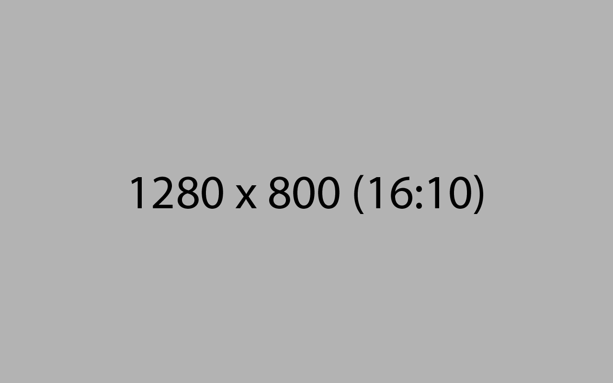
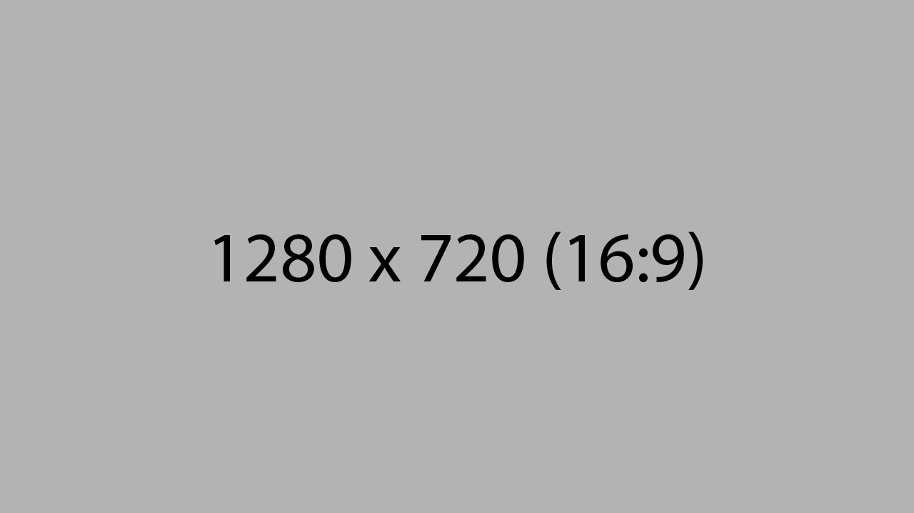

---

projectName: 'Ejemplo de título de proyecto muuuuy largo'
projectDescription: 'Lorem ipsum dolor sit amet, consectetur adipiscing elit. Aliquam dictum, velit nec porta vehicula, eros lorem tempor augue, id maximus tellus nulla quis elit.'
projectPurpose: 'Donec commodo sollicitudin enim, eu consequat turpis finibus vitae. Nulla rutrum ante non ex viverra bibendum. Proin porta elementum pellentesque. Mauris id venenatis augue.'

---

import ProjectLayout from '../../layouts/ProjectLayout.astro';
import image from '../../images/1450x815.png';

export const cover = {src: image.src, alt: 'The full Astro logo.'};

<ProjectLayout projectFrontmatter={frontmatter} projectCover={cover}>

## This Markdown file does support:

- **bold**
- _italics._
- lists
- [links](#)
- and more!

## Plain HTML and inline styles

Praesent nec odio vitae ex tempor iaculis ac sed elit. Suspendisse porttitor porta lacus, ac accumsan purus sollicitudin sit amet. Orci varius natoque penatibus et magnis dis parturient montes, nascetur ridiculus mus. Aenean ornare eleifend lacus, vel malesuada justo pharetra sed. Suspendisse vel magna urna. Nam ultricies leo in elementum eleifend. Suspendisse pretium nibh id nisl varius posuere. Vivamus in felis convallis, rutrum magna non, dignissim diam. Ut fermentum pharetra orci ac iaculis. Etiam sed nulla ullamcorper, iaculis turpis at, vehicula nibh. Cras nec eros vitae neque porttitor malesuada ut id tortor. Aenean hendrerit felis magna, venenatis vulputate purus blandit et. Fusce sed blandit nunc. Aenean blandit eu enim in finibus. Donec tristique, ante suscipit mattis feugiat, dui lorem rhoncus orci, ac fermentum mauris enim at felis.

## Blockquotes

> This is a blockquote with two paragraphs. Lorem ipsum dolor sit amet,
> consectetuer adipiscing elit. Aliquam hendrerit mi posuere lectus.
> Vestibulum enim wisi, viverra nec, fringilla in, laoreet vitae, risus.

> This is the first level of quoting.
>
> > This is nested blockquote.
>
> Back to the first level.
> 

    
Aliquam dictum, velit nec porta vehicula, eros lorem tempor augue, id maximus tellus nulla quis elit. Proin a eros non nulla tristique accumsan. Donec commodo sollicitudin enim, eu consequat turpis finibus vitae.

## Horizontal rules

* * *

***

*****

- - -

## Implicit links

Praesent nec odio vitae ex tempor iaculis ac sed elit. Suspendisse porttitor porta lacus, ac accumsan purus sollicitudin sit amet. Orci varius natoque penatibus et magnis dis parturient montes, nascetur ridiculus mus. Aenean ornare eleifend lacus, vel malesuada justo pharetra sed. Suspendisse vel magna urna. Nam ultricies leo in elementum eleifend.

I get 10 times more traffic from [Google][] than from
[Yahoo][] or [MSN][].

  [google]: http://google.com/        "Google"
  [yahoo]:  http://search.yahoo.com/  "Yahoo Search"
  [msn]:    http://search.msn.com/    "MSN Search"

</ProjectLayout>
